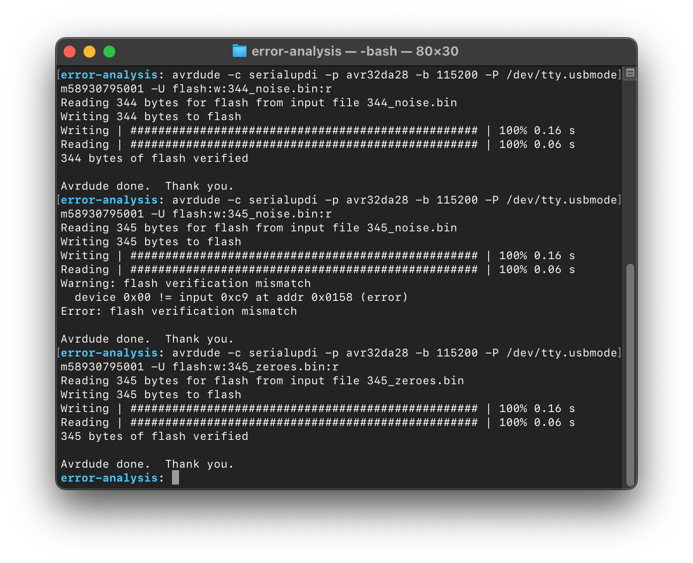
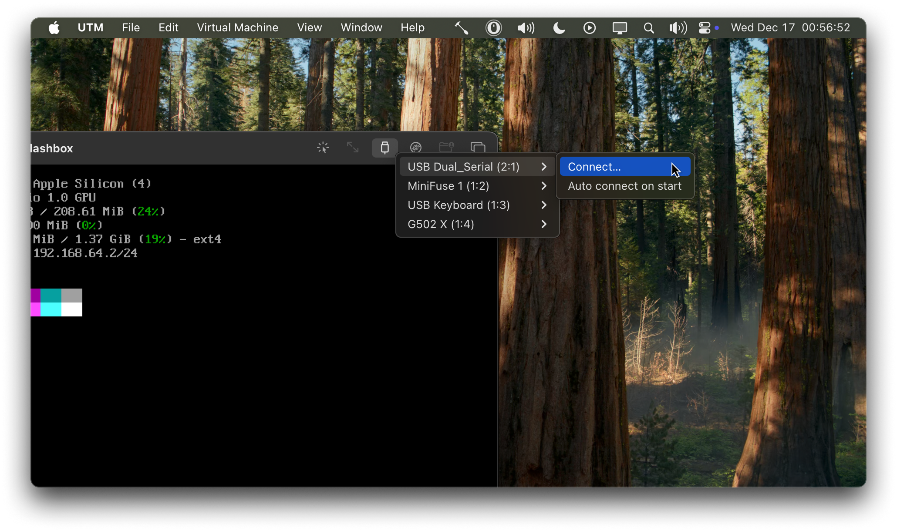

# UPDI + UART with macOS

## Introduction

This document presents an error analysis and workaround for using certain uncooperative units of [Uwe Zimmermann's UPDI + UART rev. 2 USB programmer](https://github.com/uwezi/AVR-Dx/tree/main/UPDI_plus_UART) on Apple Silicon–based Macs. Both the [error analysis](#analysis) and the [suggested workaround instructions](#workaround-instructions) are included here. This document, along with its example files and media, is licensed under the [CC0 1.0 Universal](LICENSE) license.

## Analysis

When using the provided USB programmers in the Programming Embedded Systems labs, many units have proven not to work with Apple macOS machines, while functioning without problems on Linux and Windows systems. The issue appears to be limited to specific units, as others work correctly. I brought home one working and one non-working unit to analyze the error on an M4 Mac Mini.

### USB packet capture

USB packet capture of the communication between macOS and the USB programmers has proven to be impractical.

Currently, there are no tools available for software-based USB packet capture on Apple Silicon machines, as the hardware often offloads USB data transfer directly to memory.

Hardware-based capture [has also proven difficult](https://github.com/ataradov/usb-sniffer/issues/73), likely for the same reason described above.

### Practical tests and observations

When flashing programs, or raw, randomly generated data longer than 344 bytes, to an AVR32DA28 using AVRDUDE and a problematic USB programmer unit, flash verification fails. The failure consistently occurs at address `0x158` (`344`). The same behavior is observed when using Microchip’s [`pymcuprog`](https://github.com/microchip-pic-avr-tools/pymcuprog) tool, except the failure occurs at address `0x160` (`352`) with programs longer than 352 bytes, likely due to differences in chunking behavior.

The error does not occur when flashing raw data consisting solely of zeroes, ones, alternating bits (`0b0`, `0b1`, …), alternating bytes (`0x00`, `0x01`, …), or certain low-entropy programs, for example, programs containing large arrays of zeroes, even when the total payload exceeds 344 bytes.

Flashing at impractically low baud rates does not affect the outcome of any experiment.

When using a non-problematic USB programmer, flash verification succeeds in all experiments.



### Faulty USB chip firmware hypothesis

The USB programmers use the [CH342K USB to Dual Serial Ports Chip](https://docs.sparkfun.com/SparkFun_RTK_Postcard/assets/component_documentation/CH342%20Datasheet.pdf). I hypothesize that units manufactured during early 2021 or earlier contain faulty firmware, or a faulty implementation if the chip is ASIC-based. The serial number of the problematic unit appears to be `21020HE13`, while the non-problematic unit is labeled `212934F07`. This suggests that the problematic unit was manufactured in week 2 of 2021, and the non-problematic unit in week 29 of 2021.

The fact that the error only occurs on macOS may be related to Apple Silicon’s throughput-optimized USB architecture, which offloads USB data transfer directly to memory, as mentioned earlier. This design choice could expose issues in suboptimally implemented USB clients.

## Workaround instructions

The workaround is based on running Linux inside a virtual machine and passing the USB programmer through to the VM. By using SSH and a dedicated `socat` daemon, good integration with PlatformIO on the host system can be achieved, including flashing and runtime serial monitoring. The virtual machine is minimal and uses approximately 1 GB of storage and 256 MB of RAM.

1. Install the UTM virtualization software on your machine, either via direct download from [the software’s website](https://mac.getutm.app/), via Homebrew using `brew install --cask utm`, or, if you wish to financially support the developers, by installing it through the [Mac App Store](https://apps.apple.com/us/app/utm-virtual-machines/id1538878817).

2. Open the application once to ensure it launches correctly and initializes its file associations.

3. Download the latest Alpine Linux–based UTM virtual machine file (Alpine Flashbox) from [the releases page](https://github.com/nixigaj/updi-plus-uart-macos/releases).

> [!CAUTION]
> Downloading and executing unverified software from unknown sources on GitHub can compromise your system. Always assess the reputability of the author. In this case, I assume your instructor has linked you to this repository, and as a participant in the Programming Embedded Systems course, I can assure you that this repository is reputable.

4. Extract the compressed archive to a directory of your choice for storing virtual machines.

5. Double-click the UTM virtual machine file to register it with UTM.

6. Launch the virtual machine by clicking its play button in UTM.

7. A window for the virtual machine will appear. The configured keyboard layout is Swedish.

8. Log in using the username `root`.

9. Run the command `ip -4 addr` and note the IPv4 address of the `eth0` interface. It should resemble `192.168.64.2/24`.

10. Use the following PlatformIO configuration on your macOS host system:

    ```ini
    [env:AVR32DA28]
    platform_packages = platformio/toolchain-atmelavr@^3.70300.220127
    platform = atmelmegaavr
    board = AVR32DA28
    board_build.f_cpu = 4000000UL
    upload_protocol = custom
    upload_command = scp -o StrictHostKeyChecking=no $SOURCE root@192.168.64.2:/tmp/firmware.hex && ssh -o StrictHostKeyChecking=no root@192.168.64.2 "avrdude -c serialupdi -p avr32da28 -P /dev/ttyACM0 -b 115200 -U flash:w:/tmp/firmware.hex:i"

    monitor_port = socket://192.168.64.2:4000
    monitor_speed = 19200
    ```

11. Replace the IPv4 address `192.168.64.2` in step 10 with the address determined in step 9 (excluding the subnet).

12. Plug the USB programmer into your host machine.

13. If UTM prompts you to pass the USB device through to the virtual machine, accept the prompt. Otherwise, manually pass the USB programmer by clicking the USB icon in the top-right corner of the VM window and selecting **Connect…** for the USB dual serial device.

    

> [!NOTE]
> macOS may ask you to allow UTM to take control of the USB device. If so, approve the request.

14. In the virtual machine, run `ls /dev`. If the device files `ttyACM0` and `ttyACM1` appear, the USB programmer has successfully connected. If not, unplug and replug the physical USB programmer and pass it through to the VM again.

15. Compile, flash, and monitor your AVR software from the macOS host using:

    ```sh
    pio run -t upload -t monitor
    ```

> [!NOTE]
> macOS may ask you to allow your terminal to access the local network. If prompted, allow access and re-run the command.

> [!NOTE]
> When starting serial monitoring, the initial output may appear garbled. This is expected, as the `socat` daemon in the virtual machine continuously buffers data and flushes it when a connection is established.

> [!NOTE]
> Unplugging and replugging the USB programmer while a PlatformIO serial monitor session is active may cause the UART device to be renamed (e.g., `ttyACM2`). If this occurs, close the serial monitor, unplug and replug the programmer, and pass it through to the virtual machine again.

16. Once finished, shut down the virtual machine by running the `poweroff` command, or by selecting **Virtual Machine → Power → Request power down** in UTM.
